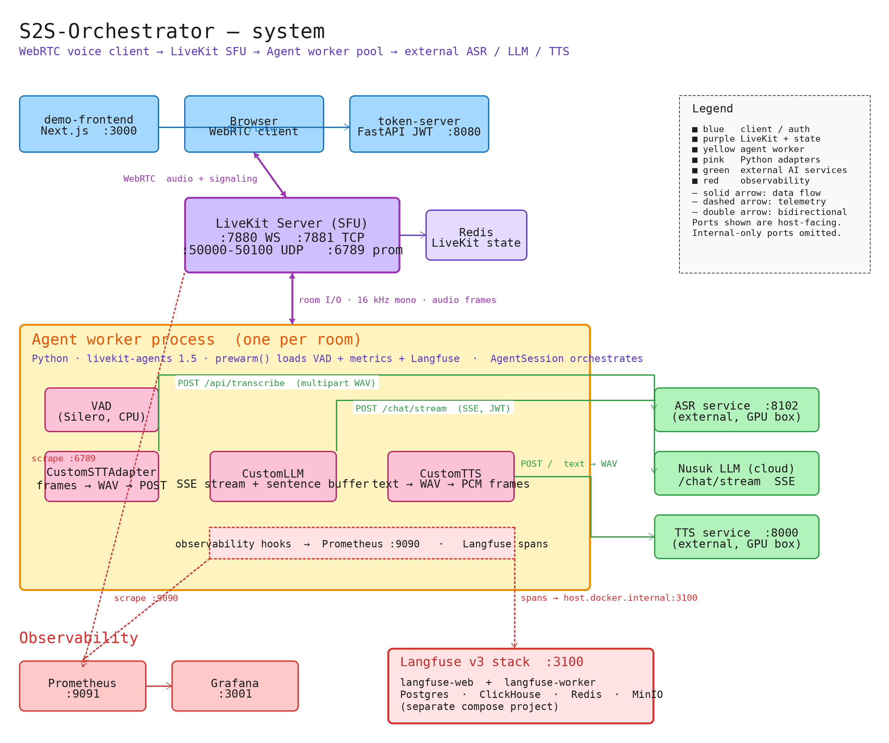

# Architecture



> Source: [diagrams/system.excalidraw](diagrams/system.excalidraw) — open in [excalidraw.com](https://excalidraw.com) or the VS Code Excalidraw extension. The PNG above is a pre-rendered snapshot; regenerate with `python3 scripts/render_excalidraw.py docs/diagrams/system.excalidraw docs/diagrams/system.png` after edits. The ASCII below is a quick reference.

## Component Diagram

```
Browser (WebRTC)
      │
      │ wss://  (signaling + media)
      ▼
┌─────────────────────────────────┐
│         LiveKit Server          │  ← SFU: routes audio between browser and agent
│  port 7880 (WS) / 7881 (TCP)   │
│  ports 50000–50100 (UDP/WebRTC) │
└──────────────┬──────────────────┘
               │ room events + audio frames
               ▼
┌─────────────────────────────────┐
│       Agent Worker Pool         │  ← Python, one process per room
│       (livekit-agents SDK)      │
│                                 │
│  VAD (Silero, preloaded)        │
│  STT adapter  ──► ASR service   │
│  LLM adapter  ──► Nusuk API     │
│  TTS adapter  ──► TTS service   │
└─────────────────────────────────┘

┌─────────────────────────────────┐
│         Token Server            │  ← FastAPI, mints LiveKit JWTs
│         port 8080               │
└─────────────────────────────────┘

┌─────────────────────────────────┐
│         Redis                   │  ← LiveKit state store (internal only)
│         port 6379               │
└─────────────────────────────────┘

┌─────────────────────────────────┐   (optional, --profile demo)
│       Demo Frontend             │  ← Next.js 15, App Router
│       port 3000                 │
│                                 │
│  /          LiveKit demo        │
│  /ptt       Push-to-talk demo   │
│  /api/token  token proxy        │
│  /api/ptt/*  PTT API proxies    │
└─────────────────────────────────┘
```

## Data Flow — LiveKit Realtime Path

```
1.  Browser calls GET /token (token-server)
      → receives {token, url, room, identity}

2.  Browser connects to LiveKit server via WebRTC (wss://livekit-server:7880)
      → LiveKit dispatches a job to the agent worker pool

3.  Agent worker joins the room
      → Agent sends greeting audio via TTS
      → AgentSession starts listening for user audio

4.  User speaks  →  VAD segments audio  →  STT adapter sends WAV to ASR
      → ASR returns transcript

5.  Transcript → LLM adapter (Nusuk /chat/stream)
      → SSE tokens stream back
      → AgentSession buffers by sentence
      → Each complete sentence triggers TTS immediately

6.  TTS adapter posts text to TTS service
      → Receives WAV → strips WAV header → pushes PCM frames to AgentSession
      → AgentSession publishes frames to LiveKit room
      → Browser receives and plays audio
```

## Data Flow — Push-to-Talk Path

```
1.  User holds button  →  MediaRecorder captures audio (webm/opus)

2.  On release: browser POSTs blob to /api/ptt/transcribe
      → Next.js proxy forwards to ASR service with Bearer token
      → Returns {transcription_text, language}

3.  Browser POSTs {query, session_id} to /api/ptt/chat
      → Next.js proxy prepends NUSUK_QUERY_PREFIX
      → Fetches Nusuk token (server-side, cached in module scope)
      → POSTs to Nusuk /chat (non-streaming)
      → Returns {response, session_id}

4.  Browser POSTs {text} to /api/ptt/tts
      → Next.js proxy strips markdown from text
      → POSTs to TTS wrapper service
      → Returns WAV audio buffer
      → Browser plays via Audio(URL.createObjectURL(blob))
```

## Machine Split (Recommended for Production)

```
CPU Machine                         GPU Machine
───────────────────────────         ──────────────────────────
livekit-server                      ASR   (port 8102)
agent workers                       TTS   (port 8000)
token-server                        LLM   (Nusuk, external)
redis
demo-frontend (optional)
```

The agent makes only HTTP calls to ASR and TTS. No code changes needed for this split — only `.env` URL updates. See [troubleshooting.md](troubleshooting.md#livekit-public-ip) for the public IP requirement.

## Configuration Entry Points

| Layer | Config source |
|---|---|
| All services | `.env` (loaded by Docker Compose) |
| LiveKit server | `livekit-server/livekit.yaml` |
| Agent | `agent/config.py` (Pydantic settings, env-prefix mapped) |
| Token server | `token-server/server.py` (Pydantic settings) |
| Demo frontend | `docker-compose.yml` environment block + Next.js `process.env` |

## Dependency Graph (startup order)

```
redis  →  livekit-server  →  agent
                          →  token-server
                          →  demo-frontend
```

All `depends_on` use `condition: service_healthy` for LiveKit so the agent does not register before the server is ready.
